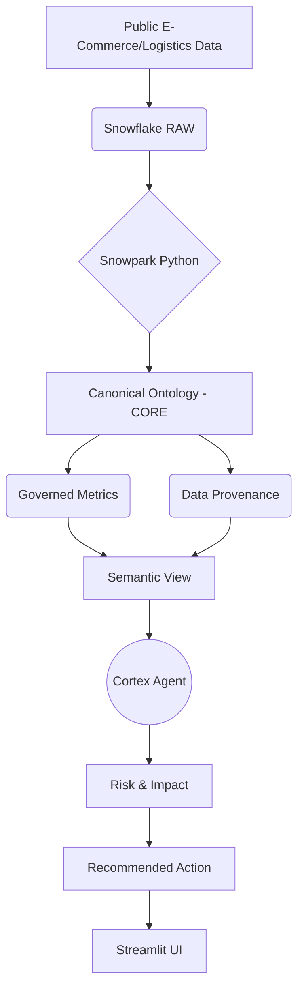

# Architecture

```mermaid
graph TD
    A[Public E-Commerce/Logistics Data] --> B(Snowflake RAW)
    B --> C{Snowpark Python}
    C --> D[Canonical Ontology - CORE]
    D --> E(Governed Metrics)
    D --> F(Data Provenance)
    E --> G[Semantic View]
    F --> G
    G --> H((Cortex Agent))
    H --> I[Risk & Impact]
    I --> J[Recommended Action]
    J --> K[Streamlit UI]
```
